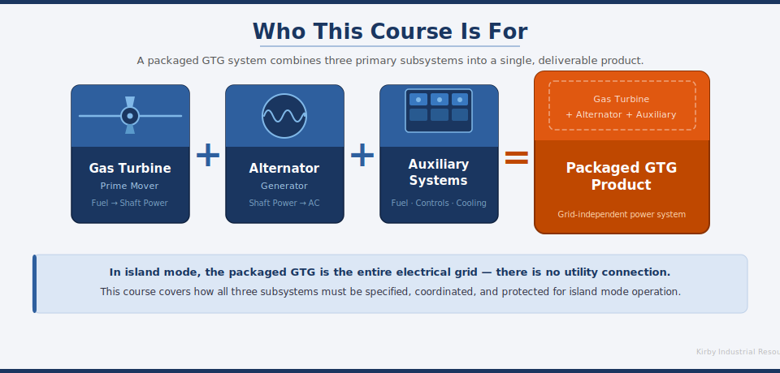
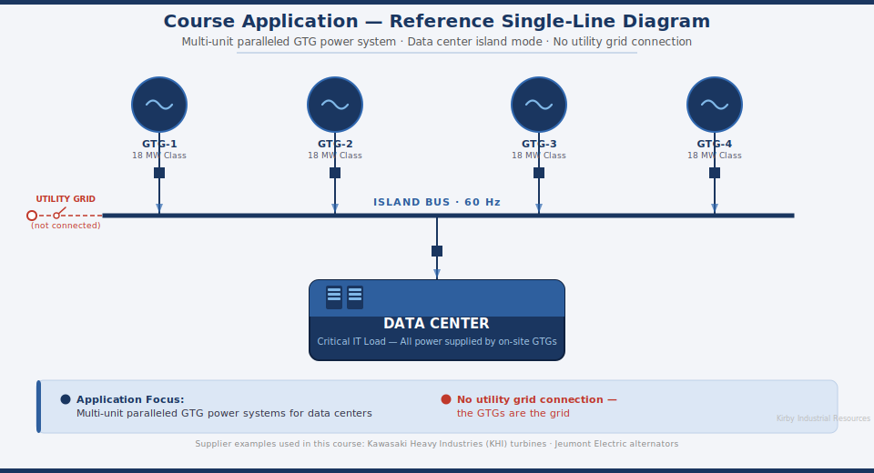
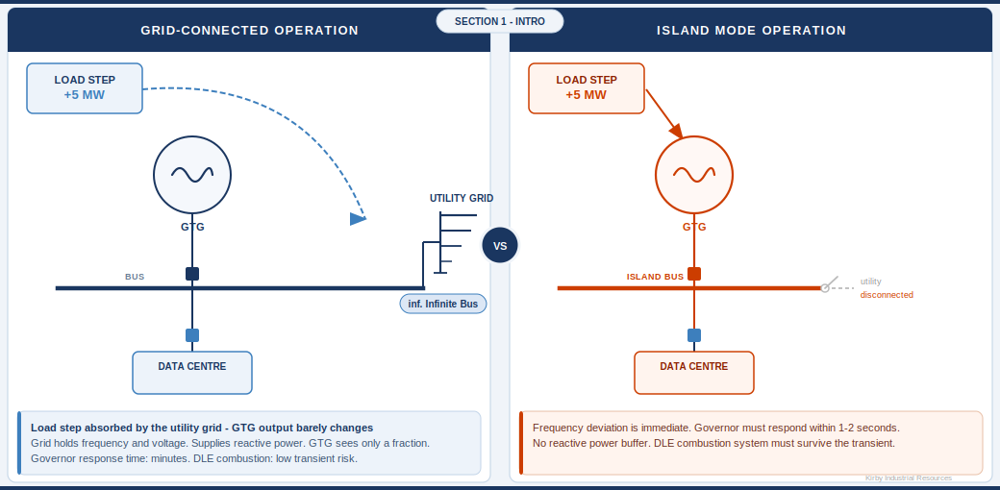

# CBT Outline: Island Mode Operation for Gas Turbine Generator Systems
### Designed for Generator Packaging Engineers | Est. Duration: 45 Minutes

---

## Document Control

| Field | Value |
|---|---|
| Course Title | Island Mode Operation: Design Principles for GTG Packaging Engineers |
| Intended Audience | Engineers, technical sales, and support staff involved with gas turbine generator packages |
| Primary Application | Multi-unit, paralleled GTG power systems for data centers |
| Supplier Examples | Kawasaki Heavy Industries (KHI) turbines, Jeumont Electric alternators (used as illustrative examples throughout) |
| Estimated Runtime | 45 minutes (instruction) + 5–8 minutes (final exam) |
| Narration | Synthesized voice-over (primary); human narrator track supported |
| Tone | Professional, technical, educational |
| Source Document | *Industry Standard Practices for Protecting Island Mode Gas Turbine Generators from Overload and Flameout*, April 2026 |
| Developed By | Kirby Industrial Resources —  |

---

## Narration Notes (Applies to All Sections)

- **Synthesized VO**: All narration scripts are written in clear, declarative sentences. Avoid contractions, idiomatic phrases, and abbreviations spoken aloud (e.g., write "megawatt" not "MW" in scripts).
- **Human Narrator**: Scripts may be delivered as written or naturally paraphrased. Side-notes to the narrator are marked **[NARRATOR NOTE]**.
- Pause markers are indicated as `[PAUSE]` for synthesized VO pacing.
- On-screen text always matches or closely mirrors narration to reinforce learning.

---

## Course Map Overview

```
Introduction (3 min)
│
├── Section 1: Grid-Connected vs. Island Mode (7 min) ──► Section Quiz 1 (2 min)
│
├── Section 2: Power Ratings, Derating, and Reserve Margin (7 min) ──► Section Quiz 2 (2 min)
│
├── Section 3: Governor and Excitation Control Systems (8 min) ──► Section Quiz 3 (2 min)
│
├── Section 4: Protection Strategies — UFLS, ROCOF, and Limiting (7 min) ──► Section Quiz 4 (2 min)
│
├── Section 5: Combustion System Constraints and DLE (6 min) ──► Section Quiz 5 (2 min)
│
├── Section 6: Multi-Unit Parallel Operation in Data Centers (5 min) ──► Section Quiz 6 (2 min)
│
├── Course Summary and Best Practices (2 min)
│
└── Final Exam (10 questions, ~8 min)

Total instruction: ~45 min | Total with exam: ~53 min
```

---

## Introduction
**Estimated Duration: 3 minutes | Screens: ~4**
**Production File:** [`CBT_Introduction.html`](CBT_Introduction.html) — Interactive HTML module (INT-1 through INT-4). Voice: Google UK English Female (en-GB). Branding: Kirby Corporation navy/orange palette.

### Screen INT-1: Title Card
- **Visuals**: Course title over a background image of a data center floor with visible generator sets or a turbine package. Kirby logo (`kirbyflag_imagefile.png`) positioned lower-right corner, consistent size and placement across all title/section intro screens.
- **On-Screen Text**: *Island Mode Operation: Design Principles for GTG Packaging Engineers*
- **VO Script**: "Welcome to this course on island mode operation for gas turbine generator systems. This course is designed to give generator packagers a clear understanding of the challenges associated with operating gas turbine generators in an island installation."

---

### Screen INT-2: Who This Course Is For
- **Visuals**: 
  *Production file: `INT-2_Who_This_Course_Is_For.svg` — Gas turbine + alternator + auxiliary systems = packaged GTG product.*
- **On-Screen Text**:
  - This course supports engineers, technical sales staff, and support personnel involved with gas turbine generator packages.
  - Applications focus on critical, grid-independent power systems — including large-scale data centers.
- **VO Script**: "Whether your role is in engineering, technical sales, or customer support, understanding how island mode changes the behavior and limits of a gas turbine generator system is essential. It enables sound design decisions and effective communication across project teams and with customers — from initial specification through commissioning and field support."

---

### Screen INT-3: Course Application
- **Visuals**: 
  *Production file: `INT-3_Course_Application.svg` — Simplified single-line diagram showing four GTGs in parallel feeding a data center bus, with no utility connection shown.*
- **On-Screen Text**:
  - **Application focus**: Multi-unit paralleled GTG power systems for data centers
  - **Supplier examples used**: Kawasaki Heavy Industries (KHI) turbines, Jeumont Electric alternators
  - No utility grid connection — the GTGs *are* the grid
- **VO Script**: "Throughout this course, our reference application is a data center powered entirely by multiple, paralleled gas turbine generators. There is no utility grid connection. The gas turbines and alternators in these packages are the only source of electrical power for the facility. Kawasaki Heavy Industries and Jeumont Electric are used as supplier examples, but the principles apply broadly across the industry."

---

### Screen INT-4: Learning Objectives
- **Visuals**: Numbered list — each item animates in (reveal on click or timed) as the corresponding VO line plays.

---

#### Synchronized VO + On-Screen Text

> **[Screen appears — intro line plays; list is blank]**
>
> **VO:** "By the end of this course, you will be able to achieve the following six learning objectives."

---

> **[Item 1 reveals]**
>
> **On-Screen Text — 1.** Explain why island mode requires different operating limits than grid-parallel operation.
>
> **VO:** "One — explain why island mode requires different operating limits than grid-parallel operation."

---

> **[Item 2 reveals]**
>
> **On-Screen Text — 2.** Define the island mode derate and the incremental reserve margin, and apply them to a representative 18 MW class turbine system.
>
> **VO:** "Two — define the island mode derate and the incremental reserve margin, and apply them to a representative eighteen megawatt class turbine system."

---

> **[Item 3 reveals]**
>
> **On-Screen Text — 3.** Describe the governor and excitation control functions required for stable island mode operation.
>
> **VO:** "Three — describe the governor and excitation control functions required for stable island mode operation."

---

> **[Item 4 reveals]**
>
> **On-Screen Text — 4.** Identify the protection systems — UFLS, ROCOF, OEL/UEL — and explain their coordination.
>
> **VO:** "Four — identify the protection systems — underfrequency load shedding, rate-of-change-of-frequency, and excitation limiting — and explain how they must be coordinated."

---

> **[Item 5 reveals]**
>
> **On-Screen Text — 5.** Explain how DLE combustion constraints affect step-load limits.
>
> **VO:** "Five — explain how Dry Low Emissions combustion constraints affect step-load limits."

---

> **[Item 6 reveals]**
>
> **On-Screen Text — 6.** Describe the coordination requirements for multi-unit parallel operation in a data center power plant.
>
> **VO:** "Six — describe the coordination requirements for multi-unit parallel operation in a data center power plant."

---

> **[All 6 items remain visible]**
>
> **VO:** "`[PAUSE]` These objectives reflect the knowledge needed to understand island mode operation, ask the right questions of turbine and generator suppliers, and clearly communicate system constraints and requirements across project teams and to customers."

---

## Section 1: Grid-Connected vs. Island Mode — Fundamental Differences
**Estimated Duration: 7 minutes | Screens: ~6 | Followed by Section Quiz 1**

### Section Intro: S1-0
- **Visuals**: 
  *Production file: `S1-0_Section_Intro.svg` — 1040×510 px static SVG. Split-screen: left panel (blue, "GRID-CONNECTED OPERATION") shows the GTG connected to a utility grid with an infinite-bus pill; right panel (orange/red, "ISLAND MODE OPERATION") shows the same GTG alone on an island bus with an open-circuit indicator and "utility disconnected" label. A centred "VS" badge sits between the two panels. Both sides show a +5 MW load step block with a dashed drop line and L-shaped power-flow arrow pointing into the load step.*
  - *Below each panel: a side-specific callout bar with three bullet lines:*
    - *Left callout — "Load step absorbed by the utility grid — GTG output barely changes" · "Grid holds frequency and voltage. Supplies reactive power. GTG sees only a fraction." · "Governor response time: minutes. DLE combustion: low transient risk."*
    - *Right callout — "Frequency deviation is immediate. Governor must respond within 1–2 seconds." · "No reactive power buffer. DLE combustion system must survive the transient." · "Alternator terminal voltage dips — AVR must restore reactive output before protection trips."*
  - *Full-width two-perspectives band at bottom:*
    - *Header: "Both scenarios are examined through two independent lenses — each one can independently cause a trip:"*
    - ***Lens 1 — Real Power & Frequency**: turbine thermal capacity, rotational inertia, governor response rate, swing equation (Screens S1-1 · S1-2 · S1-3)*
    - ***Lens 2 — Reactive Power & Voltage**: alternator reactive capability, AVR excitation speed, terminal voltage survival (Screens S1-4 · S1-5)*
- **VO Script**: "Section one. Before we discuss limits and protection systems, we need to establish a clear picture of what changes when a generator goes from grid-connected to island mode — and why those changes matter to you as a packaging engineer. `[PAUSE]` We will examine the step-load event from two perspectives. The first perspective is real power and frequency — how turbine thermal capacity and rotational inertia limit the machine's ability to absorb a sudden load increase. The second perspective is reactive power and terminal voltage — how the alternator's reactive capability and the speed of the automatic voltage regulator determine whether voltage survives the same event. Both responses happen simultaneously when a large motor starts, and either one can independently cause the system to trip."

---

### Screen S1-1 / S1-2: Real Power — A Step Load's Impact on the Turbine and Frequency *(Combined Interactive Screen)*
- **Production File:** [`S1-1_2_Step_Load_Event.html`](S1-1_2_Step_Load_Event.html) — Interactive HTML module. Single screen covering both S1-1 (grid-connected) and S1-2 (island mode) scenarios via a mode toggle.
- **Visuals**: Animated single-line diagram. Utility panel (left) and Gas Turbine Generator panel (right) feed a common distribution bus. Two loads hang off the bus:
  - **Base load** (10 MW, fixed) — always connected at x=350 on the bus; represents the existing data-centre load before the step event.
  - **Motor load** (6 MW, switchable) — at x=530 on the bus behind a knife switch; added by the **▶ RUN** button.
  - **Phase banner**: Centred label at top of the SVG diagram updates each phase with a coloured background (navy, green, or red) and descriptive text.
  - **Mode toggle**: `▰ Grid-Connected` / `⚡ Island Mode` buttons switch the entire scenario. In island mode the utility panel greys out, shows a diagonal red X overlay and a "NOT CONNECTED — ISLAND MODE" badge; the utility supply arrow hides.
  - **Run / Stop button**: Located beside the motor symbol. **▶ RUN** closes the knife switch and connects the 6 MW motor load; **■ STOP** opens it and returns to steady state. In island mode a 2.2-second auto-advance shows the transient (frequency droops to 59.2 Hz) then the settled state (GTG ramps to 16 MW, frequency restored).
  - **Power arrows**: Single `<path>` elements with CSS `transition: d` — shaft and arrowhead animate as one object. Arrow area is proportional to MW (208 px²/MW, aspect ratio 4.33). GTG arrow points left toward the bus; utility arrow points right.
  - **Badge overlays**: Four SVG badge overlays (top-left and top-right corners) flash during specific phases: "GTG STEADY — 7.0 MW" (grid loaded), "GRID ABSORBS SURGE ↑ 3→9 MW" (grid loaded), "⚠ FREQ DROOPING ↓ 59.2 Hz" (island transient), "✓ GTG ABSORBED SURGE — 16.0 MW" (island settled).
  - **Load readout panel**: Grid mode shows GTG share % and Grid share %; island mode shows GTG output MW. Both modes show total load MW.
  - **Key Concept bar**: Updates per state — describes what just happened and instructs the next action.
- **On-Screen Text (Grid-Connected — steady state)**:
  - The utility grid acts as an **infinite bus**
  - GTG supplies its contracted share (7 MW); grid supplies remainder (3 MW); total load 10 MW
  - Click **Run** to add the 6 MW step load and observe the response
- **On-Screen Text (Grid-Connected — motor running)**:
  - Grid supply surges 3 → **9 MW** instantly; GTG share drops to 44%, grid share rises to 56%
  - GTG output: **unchanged at 7.0 MW** — completely undisturbed
  - Frequency: **60.0 Hz** — never wavered
- **On-Screen Text (Island Mode — steady state)**:
  - GTG is the **sole power source** — no utility connection; supplying **10.0 MW** base load
  - Click **Run** to add the 6 MW step load and observe frequency droop
- **On-Screen Text (Island Mode — transient)**:
  - Frequency droops to **59.2 Hz** — inertia briefly supplies the gap
  - Governor is opening the fuel valve…; total load now **16.0 MW**
- **On-Screen Text (Island Mode — settled)**:
  - GTG output ramped to **16.0 MW** — absorbed the entire surge alone
  - Frequency restored to **60.0 Hz**
- **VO Script (Grid-Connected)**: "When a generator operates connected to a large utility grid, the grid functions like an infinite reservoir of voltage and frequency stability. `[PAUSE]` The screen is now showing grid-connected operation. Click the Run button beside the motor load to add the six megawatt step load and watch what happens. `[PAUSE]` If load suddenly changes, the grid absorbs the transient — the GTG output does not change at all. The utility supply surges instantly to cover the difference. Frequency stays locked at sixty hertz. `[PAUSE]` Click Stop to return to steady state, then switch to Island Mode using the button at the top and click Run again to compare."
- **VO Script (Island Mode)**: "In island mode, those buffers disappear. There is no infinite bus. The gas turbine is the only power source. `[PAUSE]` Click Run to add the same six megawatt motor load. `[PAUSE]` The same motor load that barely registered in grid-connected mode now causes an immediate frequency droop. The turbine governor must respond entirely on its own to restore the balance. `[PAUSE]` Click Stop to disconnect the motor load and reset to steady state."

---

### Screen S1-3: The Swing Equation — Frequency Is Not Free
- **Production File:** [`S1-3_Swing_Equation.html`](S1-3_Swing_Equation.html) — Interactive HTML module. Three-panel layout. Banner: "THE SWING EQUATION — FREQUENCY IS NOT FREE".
- **Visuals**:
  - **Left panel — Rotor Power Balance** (340 px wide):
    - *Turbine–rotor–load chain*: Gas turbine SVG casing icon (compressor blades, combustion glow, turbine blades) connected via a shaft-connector bar to a spinning rotor SVG (cross-arm design, rAF-driven rotation). Rotor connects via a horizontal load-connector to an electrical load box (resistor symbol + "ELEC LOAD" label).
    - *Rotor speed*: Driven by `requestAnimationFrame` loop reading `currentFreq` each frame. At 60 Hz = 0.720 deg/ms (2 rev/s); at 58.4 Hz = 0.180 deg/ms (0.5 rev/s). Speed changes smoothly — no CSS keyframe reset artifact.
    - *Three power bars*: P_mech (navy, slow transition 2.8 s), P_elec (red, fast 0.35 s), Imbalance (amber). Heights update per phase.
    - *One-line SLD*: GTG (G circle, cx=30) feeds a bus. M1 (cx=95), M2 (cx=160) are permanently connected. M3 (cx=225, labelled "M3 +STEP") is behind a knife switch. Switch starts open (blade angled). **▶ RUN / ■ STOP** button (80 px wide, beside the SLD) toggles M3.
  - **Middle panel — Equation & Facts** (278 px wide):
    - *Swing equation box*: Title "THE SWING EQUATION". Equation rendered as two proper CSS fractions side by side: **df/dt = (P_mech − P_elec) / 2H** — both df/dt and the right-hand side use `.eq-frac` flex-column layout with a 2 px horizontal bar. Term definitions below: df/dt (Hz/s), P_mech, P_elec, H (inertia constant, gas turbines typically 3–6 s).
    - *What This Means box*: Four bullet rows — P_elec > P_mech → frequency drops; P_mech > P_elec → frequency rises; low H = faster change for same imbalance; 10% load step → 1–2 Hz excursion in first second.
  - **Right panel — Frequency Meter** (flex remainder):
    - Analogue half-arc meter (r=148, centre at 192,210). Scale 57–62 Hz; each Hz = 25°. Red danger zone (57–59 Hz), green normal zone (59–61 Hz). UFLS trip dashed line at ~58.5 Hz. Needle pivots at centre; CSS transition 1.2 s linear. Digital readout below shows Hz numerically.
    - Meter caption below readout updates with phase description.
  - **Key Concept bar** (bottom, full width): Fixed text — frequency deviation governed by power imbalance / 2H; gas turbines low inertia (3–6 s); governor must respond immediately or UFLS cascades.
- **Interaction — Connect sequence (▶ RUN)**:
  1. Switch closes; `rampDown` (250 ms, 5 steps): 60.0 → 58.4 Hz, needle rotates –40°, P_elec bar rises to 90%, imbalance bar rises to 38%. Caption: "Motor 3 connected — frequency dropping".
  2. `rampRecover` (6 000 ms, 120 steps): 58.4 → 60.0 Hz, needle returns to 0°, P_mech bar rises to 90%, both bars settle equal, imbalance drops to 2%. Caption: "Governor responding — ramping back to 60 Hz".
- **Interaction — Disconnect sequence (■ STOP)**:
  1. Switch opens; `rampUp` (250 ms, 5 steps): 60.0 → 61.5 Hz, needle rotates +38°, P_mech bar 90%, P_elec 60%, imbalance 38%. Caption: "Motor 3 disconnected — frequency rising".
  2. `rampSettle` (6 000 ms, 120 steps): 61.5 → 60.0 Hz, needle returns to 0°, both bars settle to 60%, imbalance 2%. Caption: "Governor responding — settling back to 60 Hz".
- **On-Screen Text**:
  - Swing equation: **df/dt = (P_mech − P_elec) / 2H**
  - df/dt — rate of frequency change (Hz/s)
  - H — inertia constant (MWs/MVA); gas turbines typically **3–6 s**
  - P_elec > P_mech → rotor decelerates → **frequency drops**
  - 10% load step → **1–2 Hz excursion** in first second
  - **Click RUN** to connect Motor 3 step load and watch the swing
- **VO Script**: "Frequency stability is governed by Newton's second law applied to rotating machinery. If electrical load exceeds mechanical input power, the rotor decelerates and frequency drops. Gas turbines have relatively low inertia constants — typically three to six seconds — meaning frequency can change rapidly. A ten percent load step can cause a one to two hertz frequency excursion within the first second if the governor does not respond adequately. `[PAUSE]` Click the Run button on the one-line diagram to connect Motor Three and observe the rotor slow down, the frequency meter dip, and the governor recover. `[PAUSE]` Click Stop to disconnect the motor and watch frequency overshoot slightly before the governor settles back to sixty hertz. `[PAUSE]` This is the central challenge of island mode operation."

---

### Screen S1-4: The Alternator and Reactive Power — The Hidden Constraint
- **Production File:** [`S1-4_Reactive_Power.html`](S1-4_Reactive_Power.html) — Interactive HTML module. Three-panel layout. Banner: "THE ALTERNATOR AND REACTIVE POWER — THE HIDDEN CONSTRAINT".
- **Mode toggle**: `≡ Grid-Connected` / `⚡ Island Mode` buttons. Grid mode is static (Phase 0 only). Island mode enables the ▲▼ step buttons.
- **Visuals**:
  - **Left panel — Reactive Load Control** (300 px wide): ▲/▼ step buttons (disabled in grid mode) with a step label between them showing current MVAR level. Three scenario indicator dots (green/amber/red) track position through island phases. Four fixed bullet points: grid supplies reactive power; in island mode all reactive power comes from on-site alternator(s); reactive loading reduces available real power; S²=P²+Q². Instruction text updates per mode.
  - **Centre panel — P-Q Capability Curve** (flex, SVG viewBox 0 0 430 340): 20 MVA upper semicircle (r=180 px, 9 px/MW·MVAR scale, origin at 215,305). Grid lines at P=5/10/15/20 MW and Q=±5/±10 MVAR. Right sector shaded orange-tint (Overexcited/Lagging PF); left sector shaded blue-tint (Underexcited/Leading PF). Classical PF triangle inset (upper-left): P vertical leg, Q dashed horizontal, S hypotenuse with arrowhead, φ arc, "cos φ = P/S" label. Phase banner at top of SVG updates each phase. Dynamic elements per phase:
    - *Operating point* (blue dot + ring): transitions 0.8 s ease-out.
    - *Max-P dot* (navy dot on MVA arc at current Q): transitions 0.8 s ease-out.
    - *Headroom green region*: filled polygon from P-axis (Q=0) horizontally to where the MVA arc intersects the current floor P, then CCW along the arc to P=20 at the axis. On constrained phase: floor stays fixed at P=16 MW target.
    - *Red deficit region* (constrained phase only): filled polygon from P-axis at P=16 MW, right to MVA arc at P=16, CW arc down to MVA arc at P=13.2, left back to P-axis — shows real power forced below target.
    - *Headroom dashed line*: vertical from max-P dot down to operating point.
    - *"Headroom" label*: fixed at Q-axis + 5 px, P=18 MW.
    - *S-vector*: from origin to operating point with arrowhead; φ arc and live "PF = x.xx" label alongside.
    - *Crosshair dashed lines*: vertical to Q-axis, horizontal to P-axis.
  - **Right panel — Constraint Calculator** (266 px wide): Status badge (colour-coded: blue=grid, green=ok, amber=warning, red=constrained). Static "Alternator Rating: 20.0 MVA" box. Dynamic operating conditions box: Q (MVAR), P available = √(S²−Q²), P actual (turbine), Headroom (MW). Live equation box showing 20² = P² + Q² expanded numerically per phase.
  - **Key Concept bar** (full width, bottom): Updates per phase with detailed narrative.
- **Four phases**:
  | Phase | Mode | Q | P actual | P available | Headroom | Status |
  |---|---|---|---|---|---|---|
  | 0 | Grid-Connected | 0 MVAR | 16.0 MW | 20.0 MW | 4.0 MW | GRID SUPPLIES REACTIVE POWER |
  | 1 | Island — Light | 4 MVAR | 16.0 MW | 19.6 MW | 3.6 MW | ✔ OK — Headroom Available |
  | 2 | Island — Reducing | 8 MVAR | 16.0 MW | 18.3 MW | 2.3 MW | ⚠ Headroom Reducing — 2.3 MW Left |
  | 3 | Island — Constrained | 15 MVAR | 13.2 MW | 13.2 MW | 0 MW | ⛔ HEADROOM EXCEEDED — REAL POWER FORCED DOWN |
- **On-Screen Text**:
  - On the grid: reactive power is supplied by the grid — full **20.0 MVA** available for real power
  - In island mode: **all reactive power** comes from the on-site alternator(s)
  - **S² = P² + Q²** — increasing Q reduces available P at a fixed MVA rating
  - At 8 MVAR: P available = √(400−64) = **18.3 MW** — only 2.3 MW headroom remains
  - At 15 MVAR: alternator hits its thermal limit — real power is **forced down to 13.2 MW**
- **VO Script**: "The second critical difference involves reactive power. The centre of this screen shows a P-Q capability diagram — the circular boundary is the alternator's twenty megavolt-ampere thermal limit. The operating point is the dot on the diagram, and the green shaded region above it is the available real-power headroom. `[PAUSE]` The screen starts in grid-connected mode. On the grid, reactive demands are met by the grid itself — the operating point sits freely inside the MVA circle and the full headroom is available. `[PAUSE]` Now switch to Island Mode using the button at the top. `[PAUSE — VO holds here; resumes after student clicks Island Mode]` The alternator must now supply all reactive power needed by the data center loads. `[PAUSE]` Use the up arrow button on the left to increase the reactive load and watch the maximum real power available move along the MVA arc. Because the alternator has a fixed apparent power rating, every megavar spent on reactive load directly reduces the megawatts available for real work. `[PAUSE]` At eight megavars the headroom is almost gone. At fifteen megavars the alternator hits its thermal limit — the operating point is forced down the arc and real power output falls to thirteen point two megawatts, even though the turbine is thermally capable of more. This is not a minor constraint. Use the down arrow to reduce reactive load and watch the headroom recover."

---

### Screen S1-5: Voltage and Reactive Power — Reacting to Transients
- **Production File:** [`S1-5_Excitation_Voltage.html`](S1-5_Excitation_Voltage.html) — Interactive HTML module. Banner: "VOLTAGE AND REACTIVE POWER — REACTING TO TRANSIENTS". Layout mirrors S1-1/2 exactly: same SVG structure, same mode toggle, same RUN/STOP interaction — but all quantities are reactive power (MVAR) and terminal voltage (pu) instead of real power (MW) and frequency (Hz).
- **Mode toggle**: `▰ Grid-Connected` / `⚡ Island Mode` buttons. Same behaviour as S1-1/2.
- **Visuals** (SVG viewBox 0 0 1008 374):
  - **Left: Utility panel** — grid-connected version shows "UTILITY GRID (INFINITE BUS)" header, VAR support status and MVAR label, infinite-bus bars, voltage-source circle with "~". Island version: greyed, diagonal red X overlay, "NOT CONNECTED — ISLAND MODE" badge, dashed stub with open-circuit dot.
  - **Right: GTG/Alternator panel** — header "GTG / ALTERNATOR (AVR)". Generator symbol uses "A" (alternator) instead of "G". AVR status and MVAR output in header. Turbine blades + generator body same as S1-1/2.
  - **Bus bar** (y=210–220): "DISTRIBUTION BUS" label above.
  - **Reactive power arrows** (area-proportional, same formula as S1-1/2 but in MVAR):
    - Grid arrow (right-pointing, blue): "GRID VAR SUPPORT = x.x MVAR"
    - Alternator arrow (left-pointing, navy): "ALTERNATOR = x.x MVAR"
  - **Base load** (x=350): fixed 5.0 MVAR reactive load (always-on).
  - **Motor load** (x=530): 8.0 MVAR surge behind knife switch; **▶ RUN / ■ STOP** button beside it.
  - **Terminal Voltage indicator** (x=636–804, y=236–280): displays voltage in pu (e.g. "1.00 pu — Stable", "0.89 pu — Dipping ↓").
  - **Load readout panel** (y=288–346): Alt. MVAR output; Grid VAR support (grid mode only); Total reactive MVAR.
  - **Phase banner** (centre top of SVG): updates colour and text each phase.
  - **Four badge overlays** (top-left / top-right corners):
    - "✓ AVR STEADY — 2.0 MVAR" (grid loaded, top-right)
    - "GRID HOLDS VOLTAGE ↑ 3→11 MVAR" (grid loaded, top-left)
    - "⚠ VOLT DROOPING ↓ 0.89 pu" (island transient, top-left)
    - "✓ AVR RESTORED VOLTAGE — 13 MVAR" (island settled, top-right)
  - **Key Concept bar** (full width, bottom): updates per phase.
- **Four phases**:
  | Phase | Mode | Alt. MVAR | Grid MVAR | Total MVAR | Terminal V | Status |
  |---|---|---|---|---|---|---|
  | Grid Steady | Grid-Connected | 2.0 | 3.0 | 5.0 | 1.00 pu — Stable | Supplying VAR Support |
  | Grid Loaded | Grid-Connected | 2.0 (unchanged) | 11.0 (surge) | 13.0 | 1.00 pu — Stable | AVR STEADY / GRID HOLDS VOLTAGE |
  | Island Transient | Island Mode | 5.0 | — | 13.0 | 0.89 pu — Dipping ↓ | ⚠ VOLT DROOPING |
  | Island Settled | Island Mode | 13.0 | — | 13.0 | 1.00 pu — Restored | ✓ AVR RESTORED VOLTAGE |
- **On-Screen Text**:
  - Grid mode: AVR supplies its share (2 MVAR); grid supplies remainder (3 MVAR) — voltage locked at **1.00 pu**
  - Grid loaded: grid surges 3 → **11 MVAR** instantly; AVR output **unchanged at 2.0 MVAR**
  - Island transient: reactive surge pulls voltage to **0.89 pu** — AVR boosting field current
  - Island settled: AVR ramped from 5 → **13.0 MVAR** — voltage restored to **1.00 pu**
- **VO Script**: "We have seen how a step load event in island mode drives an immediate frequency droop — and how the turbine governor must respond to restore it. But the same event simultaneously drives a voltage dip. When a large motor starts, it draws a surge of reactive current. That reactive surge forces the terminal voltage down. `[PAUSE]` The screen starts in grid-connected operation. Click the Run button beside the motor load to add the eight megavar reactive surge and observe the response. `[PAUSE]` In grid-parallel operation, the grid absorbs the reactive surge instantly — the alternator output barely changes and terminal voltage holds steady at one point zero zero per unit. `[PAUSE]` Click Stop to return to steady state, then switch to Island Mode using the button at the top and click Run again to compare. `[PAUSE — VO holds here; resumes after student clicks Island Mode]` In island mode, the automatic voltage regulator is the only thing standing between the load and a complete voltage collapse. `[PAUSE]` Click Run to add the same reactive surge. `[PAUSE]` Terminal voltage immediately dips to zero point eight nine per unit — watch the AVR detect the drop and boost the alternator field current to arrest it, climbing from two megavars to thirteen megavars and restoring voltage to one point zero zero per unit. The AVR must respond within a few hundred milliseconds. If it cannot, under-voltage protection will start shedding loads. `[PAUSE]` Click Stop to reset to steady state. `[PAUSE]` This is why island mode packages require fast-response static exciters and carefully tuned AVR gain settings — requirements that are often overlooked when a package is specified for grid-parallel service and then redeployed in island mode."

---

### Screen S1-6: Summary — Why Island Mode Is Different
- **Visuals**: Clean comparison table.
- **On-Screen Text**:

| Factor | Grid-Parallel | Island Mode |
|---|---|---|
| Frequency reference | Utility grid (infinite bus) | GTG governor(s) only |
| Reactive power source | Utility grid + local generator | On-site alternator(s) only |
| Load transient buffering | Shared across many units | Entire impact on GTG(s) |
| Required headroom | Minimal | 10–15% of rated output |
| Governor response | 5–10 seconds adequate | Must respond within 1–2 seconds |
| DLE combustion risk | Low | High during transients |

- **VO Script**: "This table summarizes the key differences. The critical takeaway is that island mode is not simply grid-parallel operation without a grid connection — it is a fundamentally different operating regime that demands specific design decisions in the package, in the controls, and in the protection systems."

---

### Section Quiz 1
**4 Questions | Estimated Time: 2 minutes**

**Q1** *(Multiple Choice)*
In grid-parallel operation, a generator is largely buffered from load transients because:
- A) Its governor is faster
- B) The utility grid acts as an infinite bus, absorbing power swings ✓
- C) The alternator has a higher MVA rating
- D) DLE combustion is not required

**Q2** *(Multiple Choice)*
In island mode, a motor start draws an 8 MVAR reactive surge. The alternator's AVR detects a terminal voltage dip to 0.89 per unit and increases reactive output from 2 MVAR to 13 MVAR. What must happen if the AVR cannot respond fast enough?
- A) The turbine governor increases fuel flow to compensate for the reactive deficit
- B) Under-voltage protection activates and begins shedding loads ✓
- C) The alternator automatically switches from lagging to leading power factor
- D) The frequency meter drops below 59 Hz and UFLS Stage 1 activates
- *Feedback*: In island mode the AVR is the only source of voltage support. If it cannot arrest the voltage dip within a few hundred milliseconds, under-voltage protection will shed loads to prevent equipment damage — this is why fast-response static exciters and well-tuned AVR gain settings are required in island mode packages.

**Q3** *(Multiple Choice)*
A 20 MVA alternator is supplying 8 MVAR of reactive power. What is the maximum real power it can deliver?
- A) 20.0 MW
- B) 12.0 MW
- C) 18.3 MW ✓
- D) 16.0 MW
- *Feedback*: Using S² = P² + Q²: P = √(20² − 8²) = √(400 − 64) = √336 ≈ 18.3 MW

**Q4** *(Multiple Choice)*
Which of the following is the primary reason rapid frequency excursions occur in island mode?
- A) The alternator has insufficient MVA rating
- B) Gas turbines have low inertia constants (3–6 seconds), so power imbalances cause fast speed changes ✓
- C) DLE combustion cannot respond quickly enough
- D) Turbine governors cannot be configured for isochronous operation without modification

---

## Section 2: Power Ratings, Derating, and Reserve Margin
**Estimated Duration: 7 minutes | Screens: ~6 | Followed by Section Quiz 2**

### Section Intro: S2-0
- **Visuals**: A power output meter showing a turbine's rated capacity, with a "ceiling" marker dropping from 100% to 85–90%.
- **VO Script**: "Section two. Now that we understand why island mode is different, we can discuss how that difference translates into specific power limits. This section covers the island mode derate, how it differs from temperature derating, and the concept of incremental reserve margin — all of which directly affect how you specify and rate your packages."

---

### Screen S2-1: Two Independent Derates
- **Visuals**: Stacked bar chart showing: ISO Base Rating → minus Temperature Derate → minus Island Mode Derate = Usable Island Mode Output.
- **On-Screen Text**:
  - **Derate 1 — Temperature (Ambient Correction)**: Power reduction due to reduced air density at elevated temperatures. Applies in all operating modes.
  - **Derate 2 — Island Mode (Stability and Control)**: Additional power reduction imposed by control requirements. Applies only in island mode.
  - These two derates are **independent and cumulative**.
- **VO Script**: "Customers and suppliers sometimes confuse two distinct derations that apply to island mode packages. The first is the temperature derate — as ambient temperature rises above ISO conditions, air density falls, mass flow decreases, and thermal output drops. This applies equally in grid-connected and island mode operation. `[PAUSE]` The second is the island mode derate itself — an additional reduction applied on top of any temperature effects. A turbine rated at twenty megawatts at ISO conditions in grid-parallel may produce seventeen megawatts at forty degrees Celsius, and then only fifteen megawatts of that can be used continuously in island mode. You need to communicate both effects clearly to your customers."

---

### Screen S2-2: The Island Mode Derate — What It Is and What It Is Not
- **Visuals**: Side-by-side — a temperature gauge (thermal limit) vs. a control margin diagram (stability limit). Big "X" over the thermal gauge meaning "this is NOT the cause."
- **On-Screen Text**:
  - The island mode derate is **NOT** a thermal limit
  - The turbine's combustion system and rotating hardware have the same thermal capability in both modes
  - The derate represents **control margin** required for:
    - Transient frequency response headroom
    - DLE combustion stability during load changes
    - Reactive power reservation
    - Safe load rejection without overspeed
    - Underfrequency load shedding activation margin
- **VO Script**: "This is a point that causes significant confusion with customers. The island mode derate is not about the turbine running too hot or exceeding mechanical limits. The turbine can handle the same firing temperature and shaft torque in either mode. The derate is a control margin — headroom that the system needs to respond to events without losing stability or tripping. When a customer asks why the unit is derated, this is the explanation."

---

### Screen S2-3: Industry Standard — 18 MW Class Turbine Example
- **Visuals**: Gas turbine generator package graphic with island mode operating limits labeled.
- **On-Screen Text**:
  - ISO Base Rating: ~18 MW (at 15°C, sea level)
  - **Recommended island mode maximum: ≤ 90% ≈ 16.2 MW continuous**
  - Maximum step load increase: +25% of full load
  - Maximum step load decrease: −15% (controlled); −100% (emergency trip)
  - Load hold requirement: 1.5 min hold after a 1.5 MW step increase
- **Supplier Documentation Note**: *"Generator load must be immediately shed to below turbine full load, otherwise the turbine may shutdown due to overload"* — a stated OEM requirement when transitioning to island mode.
- **VO Script**: "These limits are explicitly documented for eighteen megawatt class turbines by leading suppliers. The recommended continuous operating ceiling in island mode is ninety percent of full load — approximately sixteen point two megawatts at ISO conditions. Step loads are limited to twenty-five percent of full load in either direction, with controlled ramp-down limited to fifteen percent. `[PAUSE]` Note the supplier statement highlighted here: if the unit transitions to island mode while overloaded, it will shut down. The control system and load shedding design must prevent this scenario."

---

### Screen S2-4: Incremental Reserve Margin (IRM)
- **Visuals**: Timeline animation showing a load step event. Meter shows: pre-step load → immediate IRM response (1–2 sec) → continued ramp → thermal limit reached (10–30 sec). Frequency trace shows initial dip, recovery.
- **On-Screen Text**:
  - **Spinning Reserve**: Power available over *minutes* (turbine ramps to max)
  - **Incremental Reserve Margin (IRM)**: Power available in *1–2 seconds* — limited by governor response, fuel system, and combustion stability
  - Industry guideline:
    - Immediate (0–2 sec): 10–15% of rated capacity
    - Short-term: +0.5–1.0% per second thereafter
  - **IRM shrinks as base load increases**
- **VO Script**: "The incremental reserve margin — often called I-R-M — is the amount of additional power the turbine can deliver within one to two seconds in response to a sudden load increase. This is different from total spinning reserve, which is available over minutes. I-R-M is what prevents a trip during a motor start or a large server rack coming online. `[PAUSE]` For a twenty megawatt turbine, I-R-M at fifteen percent means three megawatts are available instantly. But if the turbine is already running at ninety-five percent load, only one megawatt of immediate headroom exists. This is why the ninety percent continuous limit matters — it preserves a usable I-R-M."

---

### Screen S2-5: Worked Example — Data Center Load Step
- **Visuals**: Step-by-step animated calculation walkthrough.
- **On-Screen Text**:
  - Scenario: 18 MW turbine at ISO, operating at 90% island mode limit → 16.2 MW base load
  - Data center event: 1.8 MW cooling system comes online (10% step)
  - Immediate IRM: 15% of 18 MW = **2.7 MW available** → sufficient to cover 1.8 MW step ✓
  - Frequency dips briefly, governor responds, recovers within 5–10 seconds ✓
  - If base load were at 95% (17.1 MW): IRM = 0.9 MW → **insufficient** to cover 1.8 MW step → frequency decay → UFLS activation ✗
- **Key Message**: Operating within the island mode derate is what makes IRM work.
- **VO Script**: "Let's apply this to a real data center scenario. With the turbine at its ninety percent island mode limit of sixteen point two megawatts, a sudden one point eight megawatt load step represents a ten percent increase. The available I-R-M of two point seven megawatts covers this comfortably. Frequency dips, the turbine governor responds, and the system recovers. `[PAUSE]` Now move the base load up to ninety-five percent. The I-R-M drops to under one megawatt — not enough. Frequency decays rapidly, underfrequency load shedding activates, and the data center loses non-critical loads. `[PAUSE]` This is the practical consequence of ignoring the island mode derate."

---

### Screen S2-6: Alternator Ratings — MVA vs. MW
- **Visuals**: Capability curve showing apparent power (MVA) ring, with real power (MW) and reactive power (MVAR) axes. Shaded region of safe operation.
- **On-Screen Text**:
  - Turbine output is specified in **MW** (real power)
  - The alternator is rated in **MVA** (apparent power)
  - For island mode packages, size the alternator at **115–120% of the MW rating** to accommodate reactive loading
  - Example: 18 MW turbine → specify alternator at ≥ 21 MVA
  - Operating power factor target: **0.90–0.95 lagging**
- **VO Script**: "One of the most important sizing decisions in an island mode package is matching the alternator rating to the turbine output. The turbine is specified in megawatts. The alternator is rated in megavolt-amperes. In island mode, the alternator must supply both real power and reactive power for the entire data center. Industry practice is to size the alternator at one hundred fifteen to one hundred twenty percent of the turbine's megawatt rating. For an eighteen megawatt turbine, specify a generator rated at no less than twenty-one megavolt-amperes."

---

### Section Quiz 2
**4 Questions | Estimated Time: 2 minutes**

**Q1** *(Multiple Choice)*
Which of the following statements correctly describes the island mode derate?
- A) It is caused by the turbine exceeding its thermal firing temperature limit
- B) It is a control margin required for frequency stability, reactive power, and transient response ✓
- C) It only applies when ambient temperature exceeds 40°C
- D) It is an alternator limitation, not a turbine limitation

**Q2** *(Multiple Choice)*
An 18 MW class turbine has an ISO base rating of 18 MW. What is the recommended maximum continuous output in island mode?
- A) 18.0 MW
- B) 17.1 MW
- C) 16.2 MW ✓
- D) 15.3 MW
- *Feedback*: 90% of 18 MW = 16.2 MW

**Q3** *(True/False)*
Incremental Reserve Margin (IRM) and spinning reserve are equivalent terms for the same quantity.
- **False** ✓
- *Feedback*: Spinning reserve is the margin available over minutes. IRM is what is available within 1–2 seconds — a smaller, more critical quantity for island mode stability.

**Q4** *(Multiple Choice)*
For an island mode package with an 18 MW turbine, what is the minimum recommended alternator rating?
- A) 18 MVA
- B) 19 MVA
- C) 21 MVA ✓
- D) 25 MVA
- *Feedback*: 115–120% of 18 MW = 20.7–21.6 MVA. Select ≥ 21 MVA.

---

## Section 3: Governor and Excitation Control Systems
**Estimated Duration: 8 minutes | Screens: ~7 | Followed by Section Quiz 3**

### Section Intro: S3-0
- **Visuals**: Schematic showing three control loops: turbine governor (speed/fuel), alternator AVR (voltage/excitation), and load-sharing communication link between parallel units.
- **VO Script**: "Section three. The control system is where island mode design becomes most visible to customers — and where most specification disputes with suppliers arise. In this section, we cover governor control modes, automatic voltage regulation, and the coordination required between turbine and generator control systems in a multi-unit data center installation."

---

### Screen S3-1: Governor Control Modes — Droop vs. Isochronous
- **Visuals**: Two animated frequency-vs-load graphs side by side. Left shows droop (sloping line). Right shows isochronous (flat line).
- **On-Screen Text**:
  - **Droop Mode (Grid-Parallel)**:
    - Frequency decreases linearly as load increases
    - Multiple turbines share load proportionally via their droop settings
    - Grid dictates system frequency; each turbine finds its equilibrium
    - Typical droop: 3–5%
  - **Isochronous Mode (Island Mode)**:
    - Governor actively maintains frequency at setpoint (e.g., 60.0 Hz) regardless of load
    - Required for at least one unit in any island mode system
    - Provides tight frequency regulation but demands adequate headroom
- **VO Script**: "In grid-parallel operation, turbines run in droop mode. As load increases, frequency drops slightly, and all machines on the grid share load proportionally. The grid holds frequency. In island mode, frequency has no external reference. At least one unit must operate in isochronous mode — the governor actively measures frequency error and adjusts fuel flow to eliminate the deviation. `[PAUSE]` Isochronous mode is precise, but it demands headroom. If the turbine is at its limit, it cannot respond. This is why the island mode derate and I-R-M are prerequisites for isochronous control to function as designed."

---

### Screen S3-2: Multi-Unit Isochronous Load Sharing
- **Visuals**: Diagram showing three parallel GTGs connected via a communication link. Load sharing arrows show proportional distribution.
- **On-Screen Text**:
  - Multiple turbine units in isochronous mode without coordination = instability (each fights to hold frequency alone)
  - **Isochronous load sharing** via peer-to-peer digital communication link:
    - Each governor communicates current load
    - All units adjust fuel flow to share load proportionally
    - All units contribute to frequency regulation simultaneously
  - Required specification item: **load-sharing communication hardware and protocol must be explicitly specified** with the turbine supplier
- **VO Script**: "In a data center with multiple turbines, the units cannot simply run in isochronous mode without coordination. Each governor would fight the others, causing instability. The solution is isochronous load sharing — a communication link between turbine governors that allows all units to simultaneously maintain frequency while proportionally distributing load. `[PAUSE]` This communication link must be explicitly specified in the turbine purchase order. It is not always included as standard scope. Confirm the protocol, hardware, and commissioning requirements with the turbine supplier at the procurement stage."

---

### Screen S3-3: Control Mode Transition — Grid Loss Event
- **Visuals**: Animated sequence: normal operation (droop mode, grid connected) → grid fault → grid disconnect → transition to isochronous mode → stable island operation.
- **On-Screen Text**:
  - When the utility connection to the data center opens, turbine governors must detect the event and switch modes
  - Detection methods: grid breaker position feedback, frequency deviation detection, ROCOF (covered in Section 4)
  - Transition risks if not properly designed:
    - **If base load too high**: governor saturates (fuel valve fully open), frequency collapses
    - **If transition is uncoordinated**: multiple units hunt or oscillate
    - **If load shedding does not occur fast enough**: overload trip
- **VO Script**: "Mode transition from grid-connected to island mode is one of the highest-risk moments in the operating life of a GTG package. The automation — whether provided by the turbine supplier, a third party, or integrated into the plant control system — must detect the grid separation, command the appropriate governor mode change, and if necessary, initiate load shedding, all within a very short window. `[PAUSE]` The design team must ensure that the turbine can accept the required mode-switch signal, that the control system is designed to send it, and that the load shedding scheme is fast enough to keep the turbine from seeing an overload it cannot handle."

---

### Screen S3-4: Alternator AVR and Excitation Control
- **Visuals**: Block diagram showing the alternator with: rotor field winding, AVR, terminal voltage measurement, and excitation current feedback. OEL and UEL shown as limit blocks.
- **On-Screen Text**:
  - **Automatic Voltage Regulator (AVR)**: Maintains alternator terminal voltage at setpoint
  - In island mode, all data center voltage stability depends on the alternator AVR
  - Key AVR parameters for island mode:
    - Voltage droop setting: 2–4% recommended for multi-unit VAR sharing
    - Single-unit island: AVR maintains setpoint within ±0.5%
  - **Over-Excitation Limiter (OEL)**: Protects rotor from field current overheating during heavy reactive loading
  - **Under-Excitation Limiter (UEL)**: Prevents loss of synchronism during leading power factor (light load, capacitive conditions)
- **VO Script**: "The alternator's automatic voltage regulator is as critical to island mode stability as the turbine governor. The AVR controls field current, and field current controls voltage. In a multi-unit data center installation, the AVR must include voltage droop — typically two to four percent — so that reactive load is shared proportionally among all alternators rather than concentrated on one unit. `[PAUSE]` The alternator also requires over-excitation and under-excitation limiters. These protect the machine from operating outside safe regions of its capability curve. Confirm with the alternator supplier that these limiters are factory-set to be compatible with the expected reactive power range of the data center loads."

---

### Screen S3-5: Reactive Droop and VAR Sharing (Multi-Unit)
- **Visuals**: Two alternator diagrams side by side. Without reactive droop: one alternator saturates at OEL limit while the other is lightly loaded. With reactive droop: load shared proportionally.
- **On-Screen Text**:
  - Without reactive (voltage) droop: reactive load concentrates on the unit with lowest AVR setpoint — can trigger OEL trip
  - With reactive droop (2–4%): as reactive output increases, terminal voltage decreases slightly, causing loads to draw from all units proportionally
  - Multi-unit data center: **all alternators must have matching reactive droop settings**
  - Coordinate droop settings: turbine governor (frequency) + alternator AVR (voltage) must be tuned together
- **VO Script**: "Reactive droop in the alternator AVR serves the same function that speed droop serves in the turbine governor — it allows multiple machines to share a common quantity proportionally without fighting each other. `[PAUSE]` In a data center with, for example, four paralleled GTG packages, all four alternator AVRs must be set to the same reactive droop percentage. If they are mismatched, reactive load will concentrate on one unit, push that unit into its over-excitation limiter, and potentially cause a trip. Confirm these settings as part of the integrated commissioning plan."

---

### Screen S3-6: Turbine–Alternator Interface Requirements
- **Visuals**: Interface block diagram showing signal flows between turbine control, alternator excitation system, and the plant control system.
- **On-Screen Text**:
  - As the packaging engineer, **you own this interface**
  - Required signals (minimum):
    - Grid breaker status → turbine governor (mode switch trigger)
    - Turbine unit load → load sharing network
    - Alternator field current / reactive output → monitoring and limiting
    - UFLS trip commands → main breaker or load bus breakers
    - Combustion mode status → plant control (DLE vs. diffusion)
  - Verify: turbine and alternator communication protocols are compatible
  - Document: All signals in an Interface Control Document (ICD)
- **VO Script**: "As the system integrator, the interface between turbine and alternator control systems is the packager's responsibility — not the turbine supplier's and not the alternator supplier's. Both will deliver complete, functional subsystems. But the signals that connect them — grid status, load sharing data, excitation commands, protection trips — must be defined, tested, and documented by the packaging team. `[PAUSE]` Establish an interface control document early in the project. Confirm signal levels, protocols, and response times with both suppliers before fabrication begins."

---

### Section Quiz 3
**4 Questions | Estimated Time: 2 minutes**

**Q1** *(Multiple Choice)*
In island mode, which governor control mode must be used to maintain system frequency?
- A) Droop mode (3–5% droop)
- B) Isochronous mode ✓
- C) Load-following mode
- D) Baseload mode

**Q2** *(Multiple Choice)*
Why is voltage (reactive) droop required for alternators in a multi-unit parallel island mode system?
- A) To increase terminal voltage under heavy load
- B) To protect the rotor winding from overtemperature
- C) To allow multiple alternators to share reactive load proportionally without one saturating the OEL ✓
- D) To improve DLE combustion stability during transients

**Q3** *(True/False)*
The load-sharing communication link between multiple turbine governors is typically included as standard scope and does not require explicit specification.
- **False** ✓
- *Feedback*: The load-sharing communication link must be explicitly specified in the turbine purchase order. It is not always standard scope. Confirm hardware, protocol, and commissioning requirements with the turbine supplier.

**Q4** *(Scenario — Multiple Choice)*
During grid-connected operation, a data center's GTG packages are running at 85% load in droop mode. The utility connection suddenly opens. Which of the following conditions would most likely cause the turbines to trip on overload?
- A) The alternator AVR switches to reactive droop mode
- B) The base load is already high enough that the governor cannot find sufficient headroom after the mode switch to isochronous ✓
- C) The UFLS relays activate too quickly
- D) The alternator units lose synchronism with each other

---

## Section 4: Protection Strategies — UFLS, ROCOF, and Excitation Limiting
**Estimated Duration: 7 minutes | Screens: ~6 | Followed by Section Quiz 4**

### Section Intro: S4-0
- **Visuals**: Protection relay panel graphic with relay types labeled: 81 (underfrequency), 81R (ROCOF), 40 (loss of excitation), 24 (overexcitation).
- **VO Script**: "Section four. Protection systems are the safety net that keeps the island mode power system operating when events exceed design margins. In this section, we cover underfrequency load shedding, rate-of-change-of-frequency protection, and excitation limiting — and explain how these systems must be coordinated with the turbine governor and alternator characteristics."

---

### Screen S4-1: Underfrequency Load Shedding (UFLS) — Purpose
- **Visuals**: Frequency timeline showing: normal (60 Hz) → generation loss event → frequency decay curve → UFLS stages activating → frequency recovers.
- **On-Screen Text**:
  - **Purpose**: Prevent total system collapse (blackout) when generation cannot meet load
  - **Mechanism**: Automatically disconnect non-critical loads in stages as frequency drops
  - Prevents: Governor saturation, turbine overspeed, complete bus collapse
  - **Critical design principle**: Shed enough load, fast enough, without shedding critical loads
- **VO Script**: "Underfrequency load shedding — U-F-L-S — is the primary safety net for island mode power systems. When a generation deficit occurs and system frequency begins to fall, UFLS automatically disconnects non-critical loads in pre-programmed stages, reducing demand until supply and demand re-balance. Properly designed, UFLS allows the turbines to recover. Improperly designed — with stages sized too small, spaced too far apart, or with critical data center loads incorrectly assigned — UFLS fails to arrest the decline and the system collapses."

---

### Screen S4-2: UFLS — Typical Scheme for a 60 Hz Data Center
- **Visuals**: Frequency vs. time graph with stage thresholds marked. Each stage triggers a load block disconnection.
- **On-Screen Text**:

| Stage | Frequency Threshold | Load Shed | Time Delay | Load Type |
|---|---|---|---|---|
| 1 | 59.0 Hz | 15% of total | 0.5 sec | Non-critical: HVAC, lighting |
| 2 | 58.5 Hz | +15% | 0.5 sec | Secondary cooling, non-critical UPS loads |
| 3 | 58.0 Hz | +15% | 0.3 sec | Deferred process loads |
| 4 | 57.5 Hz | Remaining non-critical | 0.1 sec | All remaining non-IT loads |
| Protected | Never shed | IT load, safety systems, controls | — | Critical data center load |

- **VO Script**: "A typical four-stage UFLS scheme for a sixty hertz data center power system looks like this. Each stage sheds a defined percentage of non-critical load at successively lower frequency thresholds, with shorter time delays at lower frequencies to accelerate response as the situation worsens. `[PAUSE]` The data center's IT load — servers, storage, networking — should never be assigned to a UFLS stage. That load is precisely what the generator system exists to protect. All other loads — cooling systems, lighting, non-critical auxiliary systems — are the shedding candidates."

---

### Screen S4-3: UFLS Coordination with Turbine Governor Response
- **Visuals**: Overlaid graph: frequency decay curve vs. turbine governor fuel ramp response vs. UFLS stage activation points.
- **On-Screen Text**:
  - Turbine governors typically require 5–10 seconds to fully respond to a frequency deviation
  - UFLS Stages 1–2: allow time for governor response before shedding
  - UFLS Stages 3–4: shorter delays — frequency is deep enough that governor alone cannot recover
  - **Coordination principle**: UFLS must shed before frequency reaches 57.0 Hz (minimum safe operating limit for most equipment)
  - After UFLS activation: **do not auto-reconnect** — manually restore loads under operator supervision
- **[NARRATOR NOTE]**: Emphasize that UFLS relay settings require coordination study — not a default setting exercise.
- **VO Script**: "Coordination between UFLS and the turbine governor response is essential. The first stages of UFLS should allow five to ten seconds for the governor to respond before concluding that load shedding is necessary. But the later stages must act quickly — if frequency is approaching fifty-seven hertz, governor response alone cannot save the system. The stage delays shown here are a starting point; the actual settings for a given data center installation require a formal coordination study. `[PAUSE]` After UFLS activates, loads must be manually re-sequenced by an operator. Automatic load restoration can re-trigger UFLS or overload the turbine."

---

### Screen S4-4: Rate-of-Change-of-Frequency (ROCOF) Protection
- **Visuals**: Two frequency trace comparisons — gradual load increase (slow df/dt) vs. sudden generator trip (steep df/dt). ROCOF threshold line shown.
- **On-Screen Text**:
  - **ROCOF relay (81R)**: Measures rate of frequency change (df/dt) in Hz per second
  - Distinguishes between: gradual load growth vs. sudden generation loss
  - Typical ROCOF threshold: 0.3–1.0 Hz/s (system-specific)
  - Applications in island mode:
    - **Adaptive UFLS**: Trigger load shedding at a higher frequency if df/dt is steep (anticipate the drop)
    - **Grid separation detection**: Detect the moment the utility connection opens
    - **Generator trip recognition**: Rapidly identify which machine was lost and how much load to shed
  - Coordinate with underfrequency relays to prevent nuisance tripping
- **VO Script**: "Rate-of-change-of-frequency protection adds intelligence to the protection scheme. A ROCOF relay measures how fast frequency is changing, not just what it is. A moderate, slow frequency decline might indicate a gradual increase in load — the governor can handle it. A rapid decline of, say, one hertz per second indicates a sudden generation trip — UFLS should activate immediately, at a higher frequency, before the situation worsens. `[PAUSE]` In a data center, ROCOF can also be used to detect the moment the utility grid disconnects, triggering the island mode transition sequence in the turbine control system."

---

### Screen S4-5: Over-Excitation and Under-Excitation Limiting
- **Visuals**: Generator capability curve with OEL and UEL limits marked. Operating point shown moving toward each limit with annotations.
- **On-Screen Text**:
  - **Over-Excitation Limiter (OEL)** — Relay designation: 24/OEL
    - Protects rotor field winding from overheating under heavy reactive (lagging) loading
    - Activates if field current exceeds limit for 10–30 seconds
    - Action: Reduces excitation → terminal voltage drops → potential voltage collapse
    - Data center risk: Heavy motor load drives generator into over-excitation
  - **Under-Excitation Limiter (UEL)** — Relay designation: 40/UEL
    - Prevents loss of synchronism when operating at leading power factor
    - Risk scenario: Light IT load with long cable runs or lightly loaded transformers
    - Action: Increases excitation to restore stability margin
  - **Mitigation**: Install capacitor banks to reduce reactive burden on the alternator
- **VO Script**: "The alternator's capability curve defines a safe operating region. The over-excitation limiter protects the rotor field winding when the alternator is supplying large amounts of reactive power to inductive data center loads — transformers, motors, uninterruptible power supplies. If the OEL activates and reduces excitation, terminal voltage drops. In a data center, this can cause servers and sensitive electronics to fault. `[PAUSE]` The under-excitation limiter addresses the opposite condition — leading power factor, which can occur at light load with extensive cable infrastructure. Both limits must be verified against the expected data center load profile and communicated to the alternator supplier during the specification process."

---

### Screen S4-6: Protection Coordination Summary
- **Visuals**: Protection hierarchy diagram showing the sequence: ROCOF detection → UFLS activation → governor response → OEL/UEL limiting → last-resort turbine trip.
- **On-Screen Text**:
  - Protection layers from fastest to slowest:
    1. ROCOF relay — detects event character (ms)
    2. UFLS Stage 1–2 — load relief (0.5 sec)
    3. Turbine governor response — power recovery (5–10 sec)
    4. UFLS Stage 3–4 — additional load relief if governor insufficient (0.1–0.3 sec per stage)
    5. OEL/UEL limiting — protect alternator from capability boundary violations
    6. Turbine trip — last resort, loss of power to facility
  - All layers must be **coordinated** — gaps or overlaps cause failure
- **VO Script**: "Protection is not a single device — it is a coordinated system of layers. ROCOF detects events fastest. UFLS sheds load early enough for the turbine governor to recover system balance. OEL and UEL keep the alternator within its safe operating region. The turbine trip is the last resort. The design team's role is to ensure that these layers are coordinated as a system, not specified independently by each supplier."

---

### Section Quiz 4
**4 Questions | Estimated Time: 2 minutes**

**Q1** *(Multiple Choice)*
What is the primary purpose of underfrequency load shedding (UFLS) in an island mode data center power system?
- A) To prevent the turbines from exceeding their DLE combustion limit
- B) To automatically disconnect non-critical loads in stages to arrest frequency decline and prevent system collapse ✓
- C) To protect the alternator rotor from over-temperature
- D) To detect when the utility grid connection has been restored

**Q2** *(Multiple Choice)*
After UFLS activates and frequency recovers, what is the correct procedure for restoring shed loads?
- A) Automatic reconnection via the UFLS relay reset timer
- B) Immediate reconnection to prevent data center disruption
- C) Manual, operator-supervised sequential load restoration ✓
- D) The turbine governor will automatically manage reconnection

**Q3** *(True/False)*
A ROCOF relay measures the absolute value of system frequency to determine if a load shedding event should be triggered.
- **False** ✓
- *Feedback*: A ROCOF relay measures the *rate of change* of frequency (df/dt) in Hz per second — not the absolute frequency value.

**Q4** *(Multiple Choice)*
Which protection function activates when the alternator is supplying excessive reactive power to inductive loads and field current approaches the rotor thermal limit?
- A) Under-Excitation Limiter (UEL)
- B) Rate-of-Change-of-Frequency relay (ROCOF/81R)
- C) Over-Excitation Limiter (OEL) ✓
- D) Underfrequency Load Shedding Stage 1 (UFLS-1)

---

## Section 5: Combustion System Constraints and DLE
**Estimated Duration: 6 minutes | Screens: ~6 | Followed by Section Quiz 5**

### Section Intro: S5-0
- **Visuals**: Cross-section animation of a gas turbine combustor, showing premixed fuel-air flow.
- **VO Script**: "Section five. The combustion system is often overlooked in load shedding and control discussions, but it is one of the most important constraints on island mode operation. This section explains how Dry Low Emissions combustion technology works, why it creates step-load limits, and what packaging engineers need to specify to protect against flameout."

---

### Screen S5-1: DLE Combustion — How It Works
- **Visuals**: Animated combustor cross-section showing: premixed fuel-air inlet, lean flame zone, NOx formation vs. temperature graph (bell curve showing how DLE avoids the NOx-forming temperature range).
- **On-Screen Text**:
  - **Dry Low Emissions (DLE)** combustion is the standard technology for NOx ≤ 15–25 ppm without water injection
  - Fuel and air are **premixed** before ignition — excess air dilutes the flame
  - Combustion occurs at **lower temperature** → less NOx
  - Requires careful control of fuel-air equivalence ratio (ϕ < 0.6–0.7)
  - Used on: most modern industrial gas turbines in the 15–50 MW class
- **VO Script**: "Modern industrial gas turbines use Dry Low Emissions combustion to meet environmental regulations without water injection. Fuel and air are premixed before combustion, and the flame is intentionally lean — excess air dilutes the heat and suppresses nitric oxide formation. The system works well at steady load, but it introduces constraints that directly affect island mode design."

---

### Screen S5-2: DLE in Island Mode — The Stability Envelope
- **Visuals**: Graph showing DLE stable operating zone as a band between lean blowout (too little fuel) and rich instability (too much fuel). Arrows show what happens during rapid load steps in each direction.
- **On-Screen Text**:
  - DLE combustion operates within a **narrow stability envelope**
  - Too lean (rapid load decrease or fuel cutback): **Lean Blowout (LBO)** → flameout → turbine trip
  - Too rich (rapid load increase): **Pressure oscillations** → combustion dynamics → potential damage or mode shift
  - In island mode, rapid load transients can push the combustor out of the stable zone before feedback control can respond
- **VO Script**: "The very thing that makes DLE effective at reducing emissions — operating at near-lean-limit fuel-air ratios — also makes it sensitive to transients. If load drops suddenly and fuel flow cuts back too fast, the combustor can go lean beyond its stability limit and flame out. If load increases suddenly and fuel flow spikes, the mixture can go rich, causing pressure oscillations and combustion dynamics. In island mode, where load transients are large and the turbine must respond alone, this sensitivity is a primary design constraint."

---

### Screen S5-3: Step Load Limits and Combustion Mode Switching
- **Visuals**: Step-load magnitude diagram showing thresholds for: DLE stable zone, automatic mode switch to diffusion, and flameout risk.
- **On-Screen Text**:
  - **Industry-standard step load limit: +25% of rated capacity** to maintain DLE stability
  - What happens when limits are approached or exceeded:
    - ≤ +25%: DLE mode maintained with active fuel control compensation ✓
    - +30–40%: Automatic shift to **diffusion combustion** mode — higher NOx, but stable ✓
    - > 40% or uncontrolled: Risk of flameout and turbine trip ✗
  - **Load rejection** (sudden full unload):
    - Full emergency trip (100% unload) is typically acceptable
    - Controlled load decrease: limit to −15% steps
  - DLE requires ≥ 50% load to remain in premix mode during island operation
- **VO Script**: "The practical consequence of DLE combustion physics is a twenty-five percent step load limit. The turbine control system is designed around this limit. Steps up to twenty-five percent of full load can be absorbed in DLE mode. Beyond that threshold, the control system automatically transitions to diffusion combustion — a more fuel-rich, less emissions-controlled mode that is more tolerant of transients. Emissions compliance is temporarily sacrificed for system stability. `[PAUSE]` This is not a failure mode — it is a designed-in protection mechanism. The design team must ensure the plant and the customer understand it, and that the load shedding scheme is designed to keep individual step events within the twenty-five percent limit."

---

### Screen S5-4: DLE Load Hold Requirement (OEM Specific)
- **Visuals**: Timeline showing a load step event followed by a mandatory hold period before additional loading.
- **On-Screen Text**:
  - Representative requirement: **Hold load for N minutes after an N MW step increase**
  - Example: 1.5 MW step → hold for 1.5 minutes before additional loading
  - Purpose: Allow combustion and thermal systems to stabilize before the next transient
  - Implication for data center: **Sequential load energization must be paced** — large blocks cannot be energized back-to-back
  - Specify this requirement in the **plant load restoration procedure**
- **VO Script**: "For an 18 MW class turbine, a representative manufacturer requirement is: after a step load increase, hold at the new load for a number of minutes equal to the step size in megawatts before applying additional load. `[PAUSE]` For a data center restoring loads after a UFLS event or a planned shutdown, this means the switchgear operator cannot simply re-energize all loads as fast as the breakers will close. The re-energization sequence must be paced. This is an operational procedure requirement that originates from turbine manufacturer documentation, and it belongs in the commissioning and operations documentation."

---

### Screen S5-5: Protecting the Combustor — What to Specify
- **Visuals**: Checklist graphic with five items, each with a turbine supplier or plant control system callout.
- **On-Screen Text**:
  - ✅ **Fuel staging schedule**: Verify the turbine supplier has optimized fuel staging for the anticipated load profile
  - ✅ **Active combustion dynamics monitoring**: Pressure sensors / acoustic detection — confirm scope with the turbine supplier
  - ✅ **Automatic diffusion mode fallback**: Ensure the turbine control system includes automatic DLE-to-diffusion switching — confirm setpoints
  - ✅ **Load rate limiter**: The turbine control system should limit ramp rate to approximately 1–2 MW per minute for planned load increases (smooth ramping, distinct from step load response)
  - ✅ **Low-load DLE threshold**: Confirm with the turbine supplier the minimum load percentage at which the unit remains in DLE mode
- **VO Script**: "When specifying a gas turbine package for a data center island mode application, these five combustion-related items must be explicitly confirmed with the turbine supplier. The fuel staging schedule, combustion dynamics monitoring scope, automatic mode switching logic, load rate limiter settings, and the DLE-to-diffusion transition threshold are all parameters that affect how the system behaves during transients. Do not assume they are optimally configured for island mode by default — verify each one with the turbine supplier's engineering team."

---

### Section Quiz 5
**3 Questions | Estimated Time: 1.5 minutes**

**Q1** *(Multiple Choice)*
A gas turbine operating at 16 MW in island mode receives a sudden load step of 5 MW (approximately 28% of full load). What is the most likely control system response?
- A) Continue in DLE combustion mode — the step is within limits
- B) Automatically transition to diffusion combustion mode to maintain stability ✓
- C) Initiate a turbine shutdown on overload
- D) Activate UFLS Stage 1 at 59.0 Hz

**Q2** *(True/False)*
An OEM-documented post-step load hold period is a typical requirement before additional load steps can be applied, with hold time proportional to the magnitude of the step.
- **True** ✓

**Q3** *(Multiple Choice)*
Below approximately what load percentage does a DLE gas turbine typically shift from premix to diffusion combustion during island mode operation?
- A) 80%
- B) 65%
- C) 50% ✓
- D) 35%

---

## Section 6: Multi-Unit Parallel Operation in Data Centers
**Estimated Duration: 5 minutes | Screens: ~5 | Followed by Section Quiz 6**

### Section Intro: S6-0
- **Visuals**: Overhead view schematic of a data center power room with four GTG packages in parallel, showing the bus arrangement and load blocks downstream.
- **VO Script**: "Section six. Data center power systems based on paralleled GTGs present unique coordination challenges that go beyond what we have discussed for single-unit operation. This section addresses N-1 design philosophy, aggregate loading limits, and the key differences between coordinating turbine and alternator systems in a multi-unit configuration versus single-unit applications."

---

### Screen S6-1: N-1 Design Philosophy
- **Visuals**: Four-unit paralleled diagram. One unit shown as tripped (grayed out). Remaining three units absorb the load.
- **On-Screen Text**:
  - **N-1 requirement**: The system must sustain operation if any single generating unit trips
  - For a data center, this is typically a hard requirement
  - Without N-1 design, a single unit trip triggers total facility blackout
  - N-1 sizing rule: With N units, each unit's **island mode operating ceiling** × N units must equal or exceed total critical load + UFLS reserve
  - Example with four 18 MW class turbine units (90% island mode → 16.2 MW each):
    - Total island mode capacity: 4 × 16.2 MW = 64.8 MW
    - N-1 capacity (3 units): 3 × 16.2 MW = 48.6 MW
    - Maximum critical load: ≤ 48.6 MW (to survive any single unit trip)
- **VO Script**: "Data center owners require N-1 redundancy — the facility must continue to operate if any single generator trips. This requirement drives the number of paralleled GTG units. With four eighteen megawatt class turbine units each limited to sixteen point two megawatts in island mode, the maximum critical IT load that satisfies N-1 is forty-eight point six megawatts. Exceeding this means a single unit trip will overload the remaining three units and trigger UFLS — possibly cascading to a blackout. This calculation must be part of the system sizing documentation."

---

### Screen S6-2: Load Distribution and IRM in Multi-Unit Systems
- **Visuals**: Bar chart showing load distribution across four units at 75% of island mode limit each, with IRM headroom visible above each bar.
- **On-Screen Text**:
  - Multi-unit advantage: With four units, each can operate at a lower percentage of individual rating — preserving more IRM per unit
  - Example: 48 MW total load across four units = 12 MW each (67% of 18 MW) → leaves 4.2 MW IRM per unit
  - After N-1 trip: remaining three units absorb 48 MW / 3 = 16 MW each (88% of 18 MW) → triggers UFLS for the load above 90% limit on each surviving unit
  - **Automatic UFLS must be designed to bring load back to sustainable level within surviving units' capability**
- **VO Script**: "Multi-unit parallel operation allows each generator to run at a lower operating point, preserving more incremental reserve margin on each unit. Four units sharing forty-eight megawatts each carry twelve megawatts — well within the island mode limit — and each has healthy IRM headroom. The critical test is N-1: when one unit trips, forty-eight megawatts must be carried by three units. UFLS must shed enough load — quickly — to bring the surviving units back within their operating limits before they overload and cascade-trip."

---

### Screen S6-3: Isochronous Load Sharing Coordination (Multi-Unit)
- **Visuals**: Communication network diagram connecting four turbine governor controllers with a load-sharing bus.
- **On-Screen Text**:
  - All units in isochronous load sharing: frequency regulation shared proportionally
  - Unit trip scenario: remaining units detect frequency drop, increase output proportionally
  - The load-sharing network must include fault tolerance: if communication fails, units must default to droop mode (not isochronous — without sharing, multiple isochronous governors fight)
  - Specify with the turbine supplier: **Load-sharing network fault behavior** (default to droop on communication loss)
  - Commission: Simulate communication failure and confirm units transition to droop gracefully
- **VO Script**: "In a four-unit island mode system, all turbine governors operate in isochronous load sharing. If one unit trips, the remaining three units detect the frequency drop and increase output in proportion. The load-sharing communication network is therefore critical infrastructure — not just a convenience feature. Specify with the turbine supplier what happens when the communication link fails: the safest behavior is for all units to default to droop mode, preserving parallel stability even without coordination. Test this scenario during commissioning."

---

### Screen S6-4: Turbine and Alternator Units in Parallel — Matched Settings
- **Visuals**: Table showing matched parameter requirements for four parallel units.
- **On-Screen Text**:
  - For stable multi-unit parallel operation:

| Parameter | Turbine Supplier (All Units) | Alternator Supplier (All Units) |
|---|---|---|
| Governor type | Isochronous with load sharing | N/A |
| Governor droop (fallback) | 3–5%, matched | N/A |
| Reactive (voltage) droop | N/A | 2–4%, matched across all units |
| OEL settings | N/A | Identical, based on capability curve |
| UEL settings | N/A | Identical, based on capability curve |
| AVR gain / response | N/A | Matched to prevent inter-machine oscillations |
| Load-sharing protocol | Same on all units | N/A |

  - Mismatched settings cause: oscillation, reactive load concentration, individual unit OEL trips
- **VO Script**: "When commissioning a multi-unit installation, matched settings across all units are not optional — they are required for stable operation. All turbine units must have identical governor droop fallback settings. All alternators must have identical reactive droop and excitation limiter settings. Mismatches cause reactive load to concentrate on one alternator, or cause governor oscillation between units. Include matched-settings verification in the factory acceptance test and site acceptance test procedures."

---

### Screen S6-5: Communicating Multi-Unit Constraints to the Customer
- **Visuals**: Simple customer communication template graphic — key messages in bullet form, appropriate for a project meeting or design review.
- **On-Screen Text**:
  - **What your customer needs to understand**:
    - Each turbine unit is limited to ~16.2 MW in island mode (not the 18 MW ISO rating)
    - N-1 critical load ceiling must be held — plan the data center IT load accordingly
    - Individual load blocks must be limited to 25% of single-unit rating per step (4.5 MW max per event)
    - Load re-energization after UFLS must be sequenced per turbine supplier hold requirements, not automatic
    - Emergency operations plan must address single-unit trip response
  - **What you need from the customer**:
    - Confirmed critical vs. non-critical load classification
    - Load growth plan (future IT density increases must stay within N-1 budget)
    - Acceptance of DLE mode switching during transient events (temporary emission increase)
- **VO Script**: "This section closes with the most practical skill in this course: communicating these constraints to the data center customer clearly and early. The customer's facility planner needs to know that each unit is limited to sixteen point two megawatts in island mode, that N-1 constrains the data center's total critical load, and that load restoration after a protection event is a deliberate, sequenced procedure. Specification and commissioning documents are the foundation for this conversation."

---

### Section Quiz 6
**3 Questions | Estimated Time: 1.5 minutes**

**Q1** *(Multiple Choice)*
A data center has four gas turbine generator packages rated at 18 MW ISO (90% island mode limit). What is the maximum critical IT load the facility can carry while satisfying N-1 redundancy?
- A) 64.8 MW
- B) 54.0 MW
- C) 48.6 MW ✓
- D) 43.2 MW
- *Feedback*: N-1 = 3 units × (18 MW × 90%) = 3 × 16.2 = 48.6 MW

**Q2** *(True/False)*
In a multi-unit isochronous load sharing system, if the communication link between turbine governors fails, the safest default behavior is for all units to switch to isochronous mode independently.
- **False** ✓
- *Feedback*: Multiple independent isochronous governors without communication will fight each other for frequency control. The correct default on communication failure is to revert to droop mode, which allows proportional load sharing without coordination.

**Q3** *(Multiple Choice)*
Which of the following is NOT a valid reason for mismatched alternator AVR reactive droop settings across paralleled units?
- A) It causes reactive load to concentrate on the unit with the lowest voltage setpoint
- B) It can trigger an OEL trip on one alternator while others are lightly loaded reactively
- C) It causes the UFLS scheme to activate at incorrect frequency thresholds ✓
- D) It creates oscillation between alternators in reactive power output

---

## Course Summary and Best Practices
**Estimated Duration: 2 minutes | Screens: ~2**

### Screen SUM-1: Key Takeaways
- **Visuals**: Six numbered cards, one per section, each with a one-sentence summary.
- **On-Screen Text**:
  1. **Island mode is fundamentally different** from grid-parallel operation — no external voltage, frequency, or reactive power support.
  2. **The island mode derate (10%)** is a control margin, not a thermal limit — ceiling for an 18 MW class turbine is ~16.2 MW continuous at ISO.
  3. **Isochronous governor + alternator AVR with reactive droop** — both must be properly configured and coordinated.
  4. **UFLS, ROCOF, OEL, and UEL** must be coordinated as a system — not specified independently.
  5. **DLE combustion limits step loads to ±25% of rated capacity** — load shedding and restoration procedures must respect this constraint.
  6. **N-1 sizing, matched settings, and graceful failover** are the three non-negotiable requirements of multi-unit data center design.
- **VO Script**: "These six takeaways summarize the core principles of island mode operation for gas turbine generator systems. Each one drives a specific action — a specification requirement, a coordination study, an interface document, or a commissioning test — that must be in place before the system enters operation."

---

### Screen SUM-2: Best Practices — Your Action Checklist
- **Visuals**: Printable checklist layout (this screen should be bookmarkable or downloadable as a job aid).
- **On-Screen Text**:
  - **Specification Phase**:
    - [ ] Specify turbine for island mode — confirm isochronous governor, load-sharing link, and combustion hold requirements
    - [ ] Specify alternator at ≥ 115% of turbine MW rating (MVA)
    - [ ] Specify reactive droop 2–4% for all alternator AVRs in multi-unit installations
    - [ ] Request OEL and UEL settings as deliverables from the alternator supplier
    - [ ] Specify island mode detection logic and mode-switch signal requirements
  - **Design Phase**:
    - [ ] Perform N-1 analysis — confirm critical load ≤ (N-1) × island mode ceiling
    - [ ] Design UFLS with 4–6 stages, coordinated with turbine governor response time
    - [ ] Document turbine–alternator interface signals in an Interface Control Document (ICD)
    - [ ] Define load step limits (25% per step) in plant operating procedures
  - **Commissioning Phase**:
    - [ ] Conduct block load acceptance test: demonstrate 25% step load acceptance
    - [ ] Test isochronous mode transition from grid-connected to island mode
    - [ ] Simulate unit trip: verify UFLS activates, remaining units recover, no cascade
    - [ ] Simulate load-sharing communication failure: confirm droop fallback
    - [ ] Verify matching settings across all turbine governors and alternator AVRs
- **VO Script**: "This checklist captures the minimum set of actions for a well-designed island mode GTG package for a data center application. Use it as a starting point for your project checklist. The detailed requirements for each item are addressed in the course material and in supplier technical documentation for your specific units."

---

## Final Exam
**10 Questions | Estimated Duration: 5–8 minutes**

*Instructions displayed on screen*: "You must answer all ten questions. A score of 80% or higher (8 of 10) is required to receive course completion credit. You may not return to the course content during the exam. Each question is worth 10 points."

---

**Exam Q1** *(Multiple Choice)*
Which of the following correctly explains why the island mode derate for an 18 MW class gas turbine is approximately 10% of the ISO base rating?

- A) The turbine's combustion system cannot sustain full firing temperature without grid support
- B) The derate accounts for elevated ambient temperatures that are always present in data center environments
- C) The derate is a control margin required for transient response, reactive power, and combustion stability — not a thermal limit ✓
- D) Alternators cannot produce rated MVA without grid reactive support

---

**Exam Q2** *(Multiple Choice)*
A data center is powered by three gas turbine generator packages rated at 18 MW ISO each. What is the maximum IT load the facility should carry to maintain N-1 redundancy?

- A) 54.0 MW
- B) 48.6 MW
- C) 32.4 MW ✓
- D) 43.2 MW
- *Feedback*: N-1 = 2 units × (18 MW × 90%) = 2 × 16.2 = 32.4 MW

---

**Exam Q3** *(True/False)*
The temperature derate and the island mode derate are additive — a turbine operating in island mode at elevated ambient temperature experiences both derates simultaneously.

- **True** ✓

---

**Exam Q4** *(Multiple Choice)*
During island mode operation, the data center applies a sudden 6 MW load increase (33% of full load). What is the most likely control system response?

- A) The turbine governor increases fuel flow; the system remains in DLE combustion mode
- B) The turbine governor increases fuel flow; the combustion system automatically switches to diffusion mode to maintain stability ✓
- C) The turbine trips on overload
- D) UFLS Stage 1 activates at 59.0 Hz

---

**Exam Q5** *(Multiple Choice)*
The alternator's over-excitation limiter (OEL) activates. Which of the following consequences is most likely in the data center?

- A) System frequency drops below 59.0 Hz, triggering UFLS Stage 1
- B) Excitation is reduced, terminal voltage drops, and sensitive IT equipment may fault ✓
- C) The turbine governor switches from isochronous to droop mode
- D) Load-sharing communication between turbine units is interrupted

---

**Exam Q6** *(Scenario — Multiple Choice)*
Four paralleled gas turbine generator units are operating in isochronous load sharing. The load-sharing communication link fails between units 2 and 3. Which is the correct specified failure response?

- A) All four units switch to isochronous mode independently and maintain frequency independently
- B) All four units shut down immediately to prevent instability
- C) UFLS sheds all data center load until communication is restored
- D) All units default to droop mode, allowing proportional load sharing without communication ✓

---

**Exam Q7** *(Multiple Choice)*
An island mode data center power system includes three gas turbine generator packages rated at 18 MW ISO each. What is the minimum recommended MVA rating for each alternator unit?

- A) 18 MVA
- B) 20 MVA
- C) 21 MVA ✓
- D) 24 MVA
- *Feedback*: 115% of 18 MW = 20.7 MVA; 120% = 21.6 MVA. Minimum recommended: ≥ 21 MVA.

---

**Exam Q8** *(Multiple Choice)*
After a UFLS event in a four-unit data center power system, the data center operator wants to restore shed loads as quickly as possible. Which statement correctly describes the required procedure?

- A) Automatic reconnection is preferred to minimize downtime — UFLS relays should be set to auto-reset after frequency recovers
- B) Turbine governors will automatically manage load reconnection via the load-sharing network
- C) Loads must be manually restored by an operator in a deliberate sequence, respecting the turbine supplier's post-step load hold requirements ✓
- D) All non-critical loads can be restored simultaneously once frequency has returned to 60.0 Hz

---

**Exam Q9** *(Multiple Choice)*
Which of the following sets of conditions most clearly indicates the need for a formal coordination study between UFLS settings and turbine governor response times?

- A) The data center uses alternators with different MVA ratings on each unit
- B) The UFLS stages are set and the turbine governor response time is specified independently, without cross-checking against actual frequency decay curves for the expected N-1 event scenario ✓
- C) The installation uses only two turbine units instead of four
- D) The ambient temperature at the site exceeds ISO conditions for more than 100 days per year

---

**Exam Q10** *(Scenario — Multiple Choice)*
A packaging engineer is reviewing a customer's request to operate the island mode data center at 95% of the turbine's ISO rating (17.1 MW per unit) to maximize power density. The correct response is that:

- A) This is acceptable as long as the alternator MVA rating is increased proportionally
- B) This is acceptable during periods when DLE combustion mode is confirmed active
- C) This reduces incremental reserve margin to approximately 0.9 MW per unit — insufficient for typical data center load steps — and creates a high risk of UFLS activation or turbine trip ✓
- D) This is the standard operating practice for data centers with confirmed stable load profiles

---

## Appendix A: Glossary of Terms

| Term | Definition |
|---|---|
| AVR | Automatic Voltage Regulator — controls field current to maintain alternator terminal voltage |
| DLE | Dry Low Emissions — lean premixed combustion technology for low NOx |
| Droop Mode | Governor mode where output frequency decreases proportionally with load increase; used in grid-parallel operation |
| ICD | Interface Control Document — defines signals and protocols between turbine and alternator systems |
| IRM | Incremental Reserve Margin — power available within 1–2 seconds in response to a sudden load step |
| ISO Conditions | 15°C, 1.013 bar, 60% relative humidity — reference conditions for turbine power ratings |
| Isochronous Mode | Governor mode that maintains constant frequency regardless of load; required in island mode |
| KHI | Kawasaki Heavy Industries — gas turbine supplier |
| LBO | Lean Blowout — flameout caused by fuel-air ratio falling below DLE stability limit |
| N-1 | Design standard ensuring the system survives the loss of any single generator without total blackout |
| OEL | Over-Excitation Limiter — alternator protection against rotor overtemperature under heavy reactive loading |
| ROCOF | Rate of Change of Frequency (df/dt) — used for adaptive load shedding and grid separation detection |
| Spinning Reserve | Difference between current output and maximum continuous rating; available over minutes (not seconds) |
| UEL | Under-Excitation Limiter — prevents loss of synchronism when alternator operates at leading power factor |
| UFLS | Underfrequency Load Shedding — staged automatic load disconnection to prevent system frequency collapse |

---

## Appendix B: Production Notes

### Narration
- All scripts are written for synthesized voice-over. Spelling-out abbreviations in full (e.g., "megawatt" not "MW") is required in the final narration script delivered to the VO production tool.
- A human narrator version of each module may be recorded using the same scripts. Side notes marked `[NARRATOR NOTE]` indicate where a human narrator may add context, emphasis, or natural pauses.
- All narration scripts require a technical review by application engineers from the turbine and alternator suppliers before finalization.

### Interactivity
- Section quizzes: 2 attempts allowed, immediate feedback after each submission, score not recorded.
- Final exam: 1 attempt only, score recorded in LMS. 80% required for completion credit.
- All diagrams and animation sequences should be playable independently (click-to-replay button).
- Bookmarking: LMS must support mid-course bookmarking to allow learners to continue across sessions.

### Accessibility
- All diagrams require alt-text descriptions.
- All VO audio requires synchronized closed captions.
- Color-coded elements (e.g., safe zone vs. unsafe zone on graphs) must include a secondary distinguisher (hatching, pattern, or label) for color-blind legibility.

### Course Versioning
- This outline is Version 1.0 Draft.
  - Section content should be reviewed against current turbine and alternator supplier documentation for each project deployment. (Supplier reference documents used for this version are on file with the course development team.)
- Review cycle recommended: biannual or upon receipt of updated OEM specifications.

---

*End of Outline — Version 1.0 Draft | April 27, 2026*

---

*Developed by Kirby Industrial Resources* 
